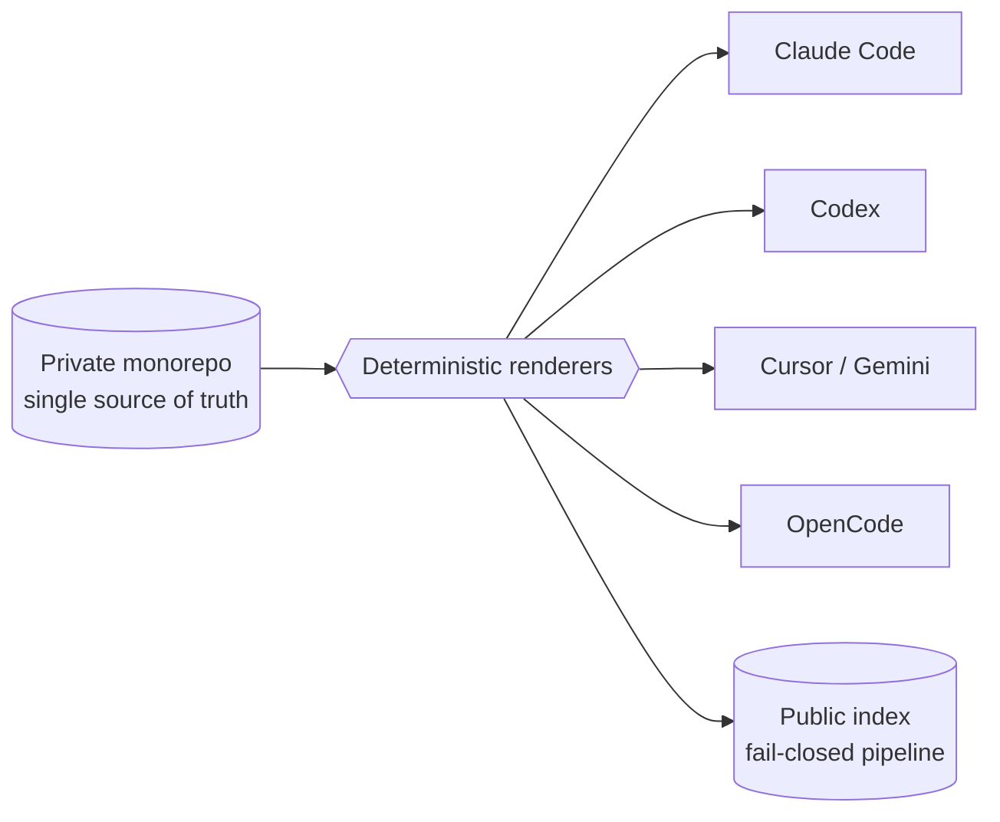

  
  

  <a href="https://github.com/WonderJL">Website</a> · <a href="CATALOG.md">Catalog</a> · <a href="AGENTS.md">AI agents</a> · <a href="https://context7.com/WonderJL/agent-tools-index">Context7</a> · <a href="https://deepwiki.com/WonderJL/agent-tools-index">DeepWiki</a> · <a href="PHILOSOPHY.md">Philosophy</a>

# agent-tools-index

> **One private monorepo. Six AI coding agents. 389 reusable capabilities — one source of truth.**

         

  <strong><a href="https://WonderJL.github.io/agent-tools-index">🔎 Explore the interactive catalog →</a></strong>

A machine-agnostic, agent-agnostic system of **skills, sub-agents, CLIs, hooks, host adapters, and
architecture decisions** — authored once and rendered into every coding agent's native format, kept
in sync across machines by git. This repository is the **public, redacted index** of that private
system: only metadata and hand-written narrative, produced by a fail-closed publisher — never
source, prompts, configs, or secrets.

## Architecture

## What makes this interesting

- **Allowlist, not denylist, at the trust boundary** — this public repo is *generated* from the
  private source by a fail-closed pipeline that structurally cannot emit what it never reads.
- **One source, deterministic renderers** — every capability is authored once and rendered into each
  host's native schema, never hand-maintained per tool.
- **On-demand libraries beat always-loaded context** — a small always-on set plus a large library
  that loads only when referenced keeps the agent's context budget small.
- **Authored vs vendored, always** — third-party tools are vendored with license + upstream
  provenance, so the system never overclaims.

## Flagship case studies

| Case study | The hard part |
|---|---|
| [One source, many agent hosts](docs/case-studies/host-agnostic-renderer.md) | Keeping the same capability consistent across six host schemas without per-host copies. |
| [A two-tier skill system that feels like one](docs/case-studies/skill-library-fallback.md) | A large, growing skill set against a fixed context budget. |
| [Hooks as a dormant-by-default library](docs/case-studies/hooks-as-library.md) | Powerful lifecycle automation that must never surprise-block a session. |
| [This index, safely projected](docs/case-studies/leak-safe-projection.md) | Publishing a portfolio from a private monorepo without leaking a single private token. |

## By the numbers

**389 published capabilities** — 182 skills (147 authored), 64
sub-agents, 50 CLIs, 52 architecture decision records, 14 host adapters,
10 integrations, 7 kits, 6 schemas, and 4 hooks.

## A few featured capabilities

| id | what it does |
|---|---|
| `plan-master` | Turns a task description into a structured engineering plan document. |
| `no-mistakes` | Ship-gate: review, test, lint, docs, PR, CI before anything merges. |
| `skill-library` | Resolves on-demand skills that are not loaded in the active session. |
| `repo-agentic-setup` | Sets up a target repo for agentic development across the four pillars. |
| `deep-research` | Generates structured, domain-specific deep-research prompts. |
| `diagnose` | Disciplined reproduce → minimise → fix loop for hard bugs and regressions. |

→ Browse all 389 items in **[CATALOG.md](CATALOG.md)**.

## Explore

- **[Interactive catalog](https://WonderJL.github.io/agent-tools-index)** — a filterable, searchable view of all 389 capabilities (GitHub Pages).
- **[CATALOG.md](CATALOG.md)** — the full human catalog: headline counts, highlights, and collapsible
  per-category tables, plus a link-out section for vendored tools.
- **[PHILOSOPHY.md](PHILOSOPHY.md)** — the engineering principles behind the system.
- **[manifest/catalog.json](manifest/catalog.json)** / **[catalog.toon](manifest/catalog.toon)** — the
  machine-readable index.
- **[PROVENANCE.md](PROVENANCE.md)** — how this repository is produced, and what is deliberately withheld.

Items are tagged **authored** (built by the owner) vs **vendored** (third-party, curated and integrated
with provenance + license), so the index is always honest about what is original work.
