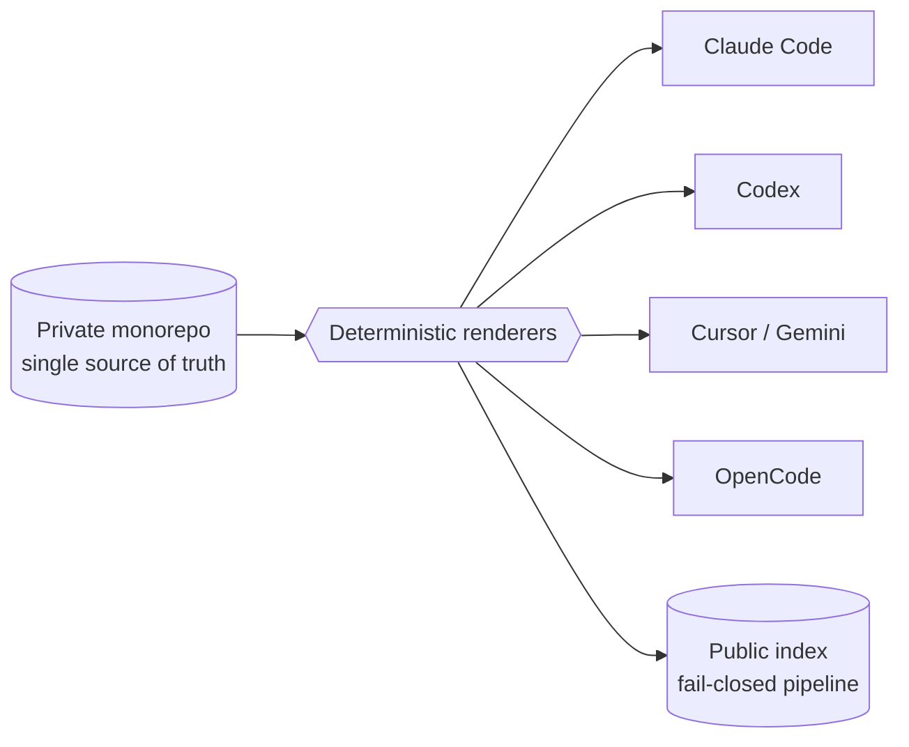

  
  

  <a href="https://github.com/WonderJL">Website</a> · <a href="CATALOG.md">Catalog</a> · <a href="AGENTS.md">AI agents</a> · <a href="https://context7.com/WonderJL/agent-tools-index">Context7</a> · <a href="https://deepwiki.com/WonderJL/agent-tools-index">DeepWiki</a> · <a href="PHILOSOPHY.md">Philosophy</a>

# agent-tools-index

> **One private monorepo. Six AI coding agents. 390 reusable capabilities — one source of truth.**
>
> _Multi-agent orchestration, token-efficient tooling, and a fail-closed public projection of a private system._

         

  <strong><a href="https://WonderJL.github.io/agent-tools-index">🔎 Explore the interactive catalog →</a></strong>
  &nbsp;·&nbsp;
  <a href="CATALOG.md">Full catalog</a>
  &nbsp;·&nbsp;
  <a href="#architecture">Architecture</a>

This is the **public, redacted index** of a private agent-tooling monorepo — only metadata and hand-written narrative, produced by a fail-closed publisher that never emits source, prompts, configs, or secrets.

Three pillars carry the system. Each is a card below.

## At a glance

| 🤖 **Multi-agent orchestration** | ⚡ **Token-efficient tooling** | 🔒 **Fail-closed projection** |
|---|---|---|
| One source, rendered into six hosts — and `ai-crew` drives Claude **and** Codex workers from a single orchestration bus. | ~37 agent-facing CLIs emit a compact structured format (TOON) instead of verbose JSON — fewer tokens spent reading tool output. | An allowlist at the trust boundary, not a denylist. This repo is the proof: generated from a private source, leaking nothing. |
| [Read the case study →](docs/case-studies/host-agnostic-renderer.md) | [See the catalog →](https://WonderJL.github.io/agent-tools-index) | [How it's projected →](docs/case-studies/leak-safe-projection.md) |

## Featured capabilities

Six capabilities, each a different kind of hard — orchestration, autonomous quality gating,
human-in-the-loop review, token efficiency, context architecture, and turnkey reuse.

| capability | what it does | why it's hard |
|---|---|---|
| **`ai-crew`** | Pushes prompts into labelled Claude *and* Codex worker sessions from one bus, then tails each transcript back with its result and token usage. | One uniform interface over two different agent harnesses — correlating asynchronous worker transcripts back to the prompt that spawned them. |
| **`no-mistakes`** | An autonomous ship-gate: review, tests, lint, docs, PR, and CI must all pass before code reaches its push target. | Gating an autonomous agent's output with no human in the loop means every stage has to be machine-checkable and fail-closed. |
| **`ai-html-chat`** | Opens an agent-built HTML artifact in a browser for a human to annotate, then polls the annotations and layout warnings back to the agent. | A human-in-the-loop channel for visual artifacts an agent can't see — the same tool used to design this repo's interactive catalog. |
| **`chrome-devtools-manager`** | An agent-ergonomic CLI that drives a real Chrome over the DevTools protocol, emitting token-efficient output with stable element references. | Live browser state is huge and noisy; emitting it compactly with references that survive re-renders is what makes multi-step automation reliable. |
| **`skill-library`** | Resolves on-demand skills that aren't loaded in the active session, fetching the archived definition the first time one is referenced. | A large, growing skill set against a fixed context budget — keep the long tail one hop away, and never refuse a capability that exists. |
| **`repo-agentic-setup`** | Makes any repository agent-ready in a single pass across the four pillars: skills, hooks, sub-agents, and routing. | Consistent, re-runnable setup across every host without hand-wiring each one as the repo evolves. |

→ Browse all 390 items in **[CATALOG.md](CATALOG.md)**.

## Flagship case studies

| Case study | The hard part |
|---|---|
| [One source, many agent hosts](docs/case-studies/host-agnostic-renderer.md) | Keeping the same capability consistent across six host schemas without per-host copies. |
| [A two-tier skill system that feels like one](docs/case-studies/skill-library-fallback.md) | A large, growing skill set against a fixed context budget. |
| [Hooks as a dormant-by-default library](docs/case-studies/hooks-as-library.md) | Powerful lifecycle automation that must never surprise-block a session. |
| [This index, safely projected](docs/case-studies/leak-safe-projection.md) | Publishing a portfolio from a private monorepo without leaking a single private token. |

## Architecture

→ **[docs/architecture.md](docs/architecture.md)** — the nine-pillar model, the generation/redaction
pipeline, the leak-safe projection layers, and library-fallback resolution, each with a diagram.
Per-pillar narrative lives in **[docs/pillars/](docs/pillars/)**.

## What makes this interesting

- **Allowlist, not denylist, at the trust boundary** — this public repo is *generated* from the
  private source by a fail-closed pipeline that structurally cannot emit what it never reads.
- **One source, deterministic renderers** — every capability is authored once and rendered into each
  host's native schema, never hand-maintained per tool.
- **On-demand libraries beat always-loaded context** — a small always-on set plus a large library
  that loads only when referenced keeps the agent's context budget small.
- **Authored vs vendored, always** — third-party tools are vendored with license + upstream
  provenance, so the system never overclaims.
- **Token-efficient by default** — ~37 agent-facing CLIs emit a compact structured format (TOON)
  rather than verbose JSON, so an agent spends fewer tokens reading tool output.
- **Code intelligence behind one router** — the repo's code-intelligence index (call graph +
  impact analysis) is fronted by a single MCP router, so agents reach it through one routed entry
  point instead of a sprawl of servers.

## By the numbers

**390 published capabilities** — 182 skills (147 authored), 64
sub-agents, 50 CLIs, 53 architecture decision records, 14 host adapters,
10 integrations, 7 kits, 6 schemas, and 4 hooks.

## Explore

- **[Interactive catalog](https://WonderJL.github.io/agent-tools-index)** — a filterable, searchable view of all 390 capabilities (GitHub Pages).
- **[CATALOG.md](CATALOG.md)** — the full human catalog: headline counts, highlights, and collapsible
  per-category tables, plus a link-out section for vendored tools.
- **[manifest/catalog.flat.md](manifest/catalog.flat.md)** — a flat, retrieval-friendly mirror of the
  catalog (one bullet per item, no collapsibles/HTML) for tools that read this repo.
- **[docs/architecture.md](docs/architecture.md)** / **[docs/pillars/](docs/pillars/)** — architecture
  diagrams and a narrative page per pillar.
- **[PHILOSOPHY.md](PHILOSOPHY.md)** — the engineering principles behind the system.
- **[manifest/catalog.json](manifest/catalog.json)** / **[catalog.toon](manifest/catalog.toon)** — the
  machine-readable index.
- **[PROVENANCE.md](PROVENANCE.md)** — how this repository is produced, and what is deliberately withheld.

Items are tagged **authored** (built by the owner) vs **vendored** (third-party, curated and integrated
with provenance + license), so the index is always honest about what is original work.
