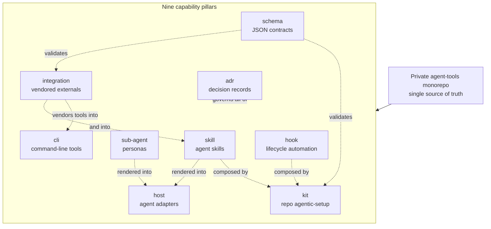
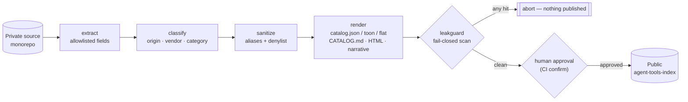
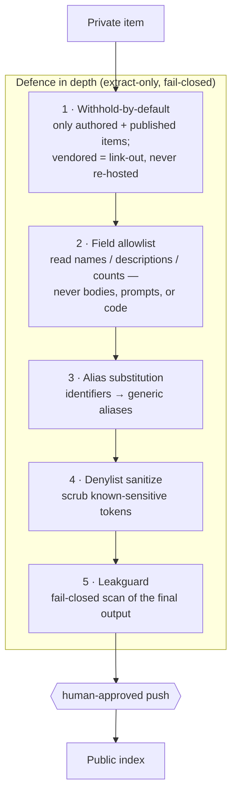
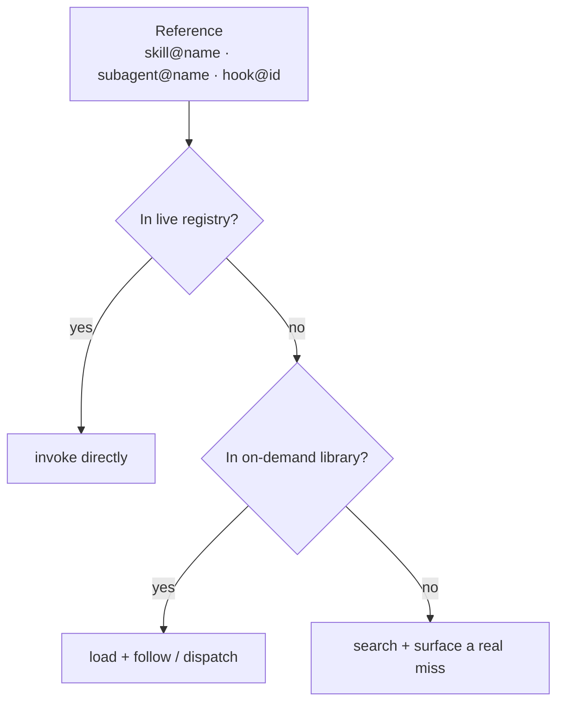

# Architecture

This page is the map of the system that `agent-tools-index` is a projection of. It is
**hand-written narrative** (not generated) and contains no private internals — only the shape of
the system and the boundary that keeps the public index leak-safe. For the principles behind these
choices see [PHILOSOPHY.md](../PHILOSOPHY.md); for the redaction policy see
[PROVENANCE.md](../PROVENANCE.md); for the item inventory see [CATALOG.md](../CATALOG.md) and its
flat mirror [manifest/catalog.flat.md](../manifest/catalog.flat.md).

## The system in one sentence

A single private monorepo holds reusable agent capabilities, authored once and rendered
deterministically into every coding agent's home; this public repository is one such rendered
projection — metadata and narrative only, regenerated rather than edited.

## The nine pillars

Capabilities are organised into nine pillars. Each row in the catalog belongs to exactly one. The
pillars are not independent silos — they compose.

- **skill / sub-agent / cli / hook** — the capabilities themselves: skills (procedural know-how),
  sub-agent personas, command-line tools, and lifecycle automation hooks.
- **kit** — composes hooks and skills into a one-command agentic setup for a target repository.
- **host** — a thin per-host adapter; capabilities are authored once in the core and rendered into
  each agent host rather than re-authored per tool.
- **integration** — third-party tools vendored with their upstream source and license recorded, so
  authored and vendored work are always distinguishable.
- **schema** — JSON contracts that validate kits, integrations, and manifests.
- **adr** — short architecture decision records; the index surfaces their titles and status so the
  *shape* of the system's evolution is legible without exposing internals.

Each pillar has a dedicated narrative page under [docs/pillars/](pillars/).

## How this index is generated

`agent-tools-index` is never hand-edited. A publisher in the private repo runs a deterministic,
fail-closed pipeline and a human approves the final push.

The pipeline only ever *reads* an explicit allowlist of fields (names, one-line descriptions,
counts, categories, origin tags) and the hand-written narrative. It never reads item bodies,
prompts, or source — so it structurally cannot emit them.

## Leak-safe projection

Crossing the private → public boundary is treated as adversarial. Five layers of defence sit in
front of the human approval gate; any single layer firing closed stops the publish.

Withheld items are *counted* in [manifest/stats.json](../manifest/stats.json) but never named — a
row's absence means it was withheld, not that the capability does not exist.

## On-demand library resolution

A small live set covers the common path; a large on-demand library covers the long tail. A single
resolution rule makes the two tiers feel like one: a reference such as `skill@<name>` (and likewise
`subagent@<name>` / `hook@<id>`) is resolved live-first, then from the library, and only declared
missing after both fail.

## Where to go next

- **[CATALOG.md](../CATALOG.md)** — the full human catalog (counts, highlights, per-pillar tables).
- **[manifest/catalog.flat.md](../manifest/catalog.flat.md)** — flat, retrieval-friendly mirror.
- **[manifest/catalog.json](../manifest/catalog.json)** — the machine source of truth.
- **[docs/pillars/](pillars/)** — a narrative page per pillar.
- **[PHILOSOPHY.md](../PHILOSOPHY.md)** · **[PROVENANCE.md](../PROVENANCE.md)** ·
  **[AGENTS.md](../AGENTS.md)** — principles, redaction policy, and how an agent should read this repo.
