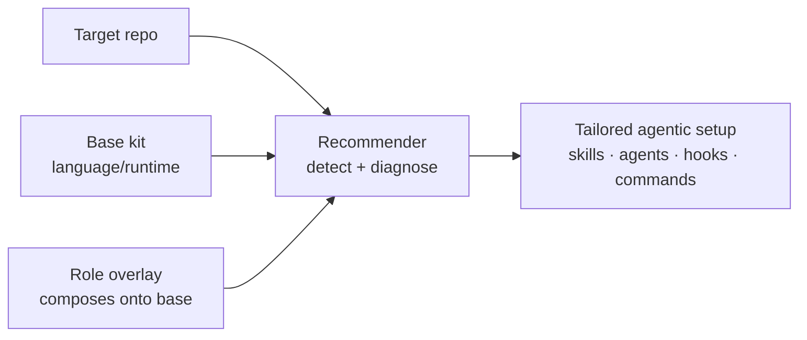

# Kit pillar

The kit pillar turns a freshly cloned repository into one that is ready for AI-assisted development. A kit is the curated, version-controlled baseline a repo agentic-setup run starts from: a recommender detects what the repo is, loads the matching kit(s), and then tailors the result — pruning or adding — based on the gaps it diagnoses. A kit is always a starting point, never a forced install, so the human stays in control of what lands in the target repo.

Kits are declarative YAML and split along two clean axes so they compose instead of duplicating. A **base** is per language/runtime and backend-leaning — `Python (backend)`, `Go (backend)`, `Node / TypeScript (backend)`, and `Rust (backend)` — carrying TDD, debugging, and verification skills, architecture and review agents (for example `backend-architect`, `code-reviewer`, `oracle`), and format/typecheck/secret hooks. An **overlay** is per role and layers *onto* a base: `Frontend — React / Next.js`, `CLI tool`, and `Data / ML`. All 7 items here are authored in-repo (none vendored). Each declares the same vocabulary — `detect`/`applies_when`, `skills`, `sub_agents`, `hooks`, `commands`, `routing` overrides, and `diagnostics` — referencing capabilities by name from the other pillars (`skill@`, `subagent@`, `hook@`) rather than embedding them, so kits stay thin and the underlying libraries remain the source of truth.

Composition is a union: the recommender resolves every matching base plus every matching overlay, unions their picks, and on conflict the overlay wins. A Next.js-on-NestJS repo resolves the Node/TypeScript base plus the React overlay; a Python ML project resolves the Python base plus the Data / ML overlay.

**See also:** [Catalog](../../CATALOG.md#kit) · [Flat catalog](../../manifest/catalog.flat.md) · [Architecture](../architecture.md) · [Philosophy](../../PHILOSOPHY.md)
