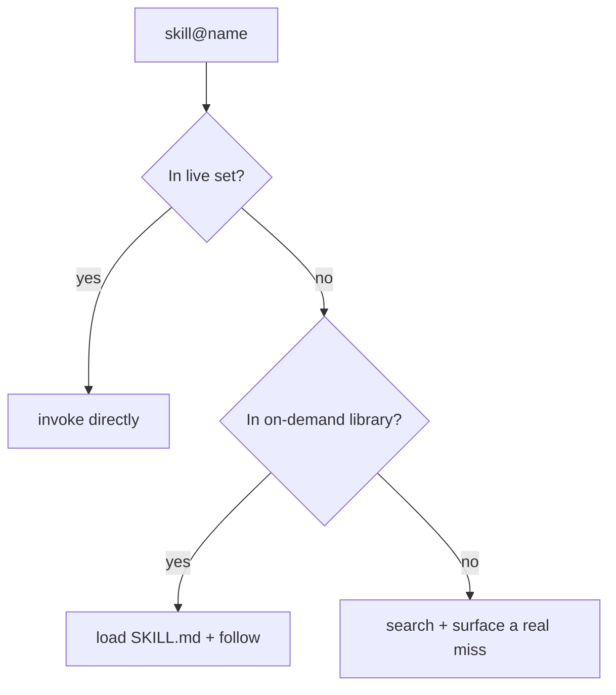

# Skill pillar

The **skill** pillar is the largest in the system: procedural know-how the agent can load to perform a task well — writing, refactoring, debugging, diagramming, planning, git workflows, and agent meta-tooling. It is the clearest expression of the system's third principle, [on-demand libraries beat always-loaded context](../../PHILOSOPHY.md). A small **live** set is auto-loaded into every session to cover the common path and keep ambient context lean; a much larger **on-demand library** carries the long tail and loads only when a skill is referenced. A single resolution rule stitches the two tiers into one: a `skill@<name>` reference is checked against the live registry first, loaded from the library if not live, and only declared missing after both fail.

Each skill is a directory containing a `SKILL.md` with YAML frontmatter — a `name`, a trigger-shaped `description` (third-person, with the situations that should activate it), and an `activation` block (`manual`, `auto`, or `always`). It may add optional `scripts/`, `references/`, and `commands/` subdirectories. Authoring follows progressive disclosure: keep `SKILL.md` lean, inline small references, and pull large ones in only when needed. The 180 catalogued skills span categories such as engineering quality and debugging, writing and content, git/PR/commit, animation, diagrams, and agent/skill meta-tooling. Most are authored, but 33 are **vendored** and tagged distinctly from authored work, with upstream source and license recorded — for example the GSAP animation skills (`gsap-core`, `gsap-timeline`) carry their MIT license, and the Superpowers framework is vendored to load on demand rather than auto-inject into every session. Authored exemplars include `plan-master` (structured engineering plans), `text-refiner`, and `git-commit-message`.

**See also:** [Catalog](../../CATALOG.md#skill) · [Flat catalog](../../manifest/catalog.flat.md) · [Architecture](../architecture.md) · [Philosophy](../../PHILOSOPHY.md)
