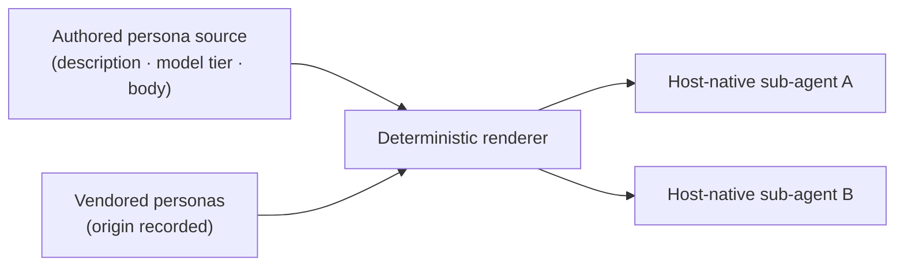

# Sub-agent pillar

Sub-agents are named personas the main agent can dispatch for a focused, well-scoped task — a code review, an implementation plan, a stress-test of a decision — and then collect the result from. Each persona ships as a single source file with a short description, a model tier, and a body of operating instructions; a deterministic renderer projects that one source into each host's native sub-agent format, so the authored file stays the single source of truth across tools.

The pillar holds 64 personas, split between a small authored core (8) and a larger vendored set (56). Every persona carries a model tier: a routine **standard** default for review and coordination work, and a reserved **deep-reasoning** tier for roles whose job *is* hard thinking. The authored core includes `plan-master` (an engineering planner pinned to the deep-reasoning tier for plan quality), `strategic-partner` (a read-only thinking partner that challenges assumptions and surfaces blind spots before execution), and `oracle` (a principal advisor for deep reviews and architecture calls). Across the whole pillar, personas cluster into **engineering / implementation** (15), **design / UX / content** (17), **review / quality / security** (14), **planning / strategy / advisory** (6), and **product / project management** (6); most of that long tail is vendored — drawn from a pinned third-party collection and recorded with its upstream origin, with examples like `backend-architect`, `api-tester`, and `accessibility-auditor`. Authored and vendored personas are always distinguishable, and they flow through the same renderer pipeline regardless of origin.

**See also:** [Catalog](../../CATALOG.md#sub-agent) · [Flat catalog](../../manifest/catalog.flat.md) · [Architecture](../architecture.md) · [Philosophy](../../PHILOSOPHY.md)
